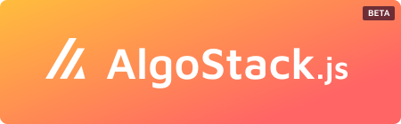

# 


Everything you need to interact with the **Algorand** blockchain, all bundled together to make your life easier. **All modules are optional**, so you make your own compiled stack as small as possible.

## Table of Contents

- [📦 What's in there](#whats-bundled-in-the-stack)
- [⚡ Getting Started](#getting-started)
- [🔐 Connecting a wallet](/doc/client.md)
- [📡 Sending transactions](/doc/txns.md)
- [📚 Reading blockchain data](/doc/query.md)
- [❌ Common issues](/doc/issues.md)


## 📦 What's in the stack?
- [js-algorand-sdk](https://github.com/algorand/js-algorand-sdk)
- [myalgo-connect](https://github.com/randlabs/myalgo-connect)
- [walletconnect/client](https://github.com/WalletConnect/walletconnect-monorepo)
- [algorand-walletconnect-qrcode-modal](https://github.com/algorand/walletconnect-monorepo)


## ⚡ Getting Started

First, import the main package, and all modules you need. Then initiate your AlgoStack with the desired options and modules.

```ts
const algostack = new AlgoStack(options: OptionsProps, modules: PlugableModules)
```

Example: 

```js
import AlgoStack from 'algostack';
import Client from 'algostack/Client';
import Txns from 'algostack/Txns';
import Query from 'algostack/Query';

const algostack = new AlgoStack(
  {
    convertCase: 'camelcase',
    apiUrl: 'https://testnet-api.algonode.cloud',
    indexerUrl: 'https://testnet-idx.algonode.cloud', 
  }, 
  { Client, Txns, Query }
);
```


### ⚙️ Options
```ts
interface OptionsProps {
  // Indexer and Node urls used to interact with the blockchain
  indexerUrl?: string, // default: 'https://mainnet-idx.algonode.cloud'
  apiUrl?: string, // default: 'https://mainnet-api.algonode.cloud'
  apiPort?: number,
  apiToken?: string,
  

  // Persist wallet connections, even after refreshing
  // Only available in browsers
  persistConnection?: boolean // default: true,
  storageNamespace?: string // default: 'algostack',
}
```


### 🔌 Plugable Modules

```ts
interface PlugableModules {
  // Connect to Algorand using popular wallets
  // Currently available: MyAglo, Pera Wallet
  Client?: ClientModule,
  
  // Create, sign, send transactions and wait for confirmation 
  Txns?: TxnsModule,

  // Get data from the blockchain
  // Currently using the indexers only
  Query?: QueryModule,
} 
```