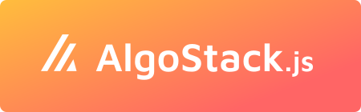

# 


Everything you need to interact with the **Algorand** blockchain, all bundled together to make your life easier. **All modules are optional**, so you can make sure the compiled code is as small as possible.

## What's bundled in the stack?
- [js-algorand-sdk](https://github.com/algorand/js-algorand-sdk)
- [myalgo-connect](https://github.com/randlabs/myalgo-connect)
- [walletconnect/client](https://github.com/WalletConnect/walletconnect-monorepo)
- [algorand-walletconnect-qrcode-modal](https://github.com/algorand/walletconnect-monorepo)


## Getting Started

First, import the main package, and all modules you need. Then initiate your AlgoStack with the desired options and modules.

```js
const algostack = new AlgoStack(options: {}, modules: [])
```

Example: 

```js
import AlgoStack from 'algostack';
import Client from 'algostack/client';
import Txns from 'algostack/txns';
import Query from 'algostack/query';

const algostack = new AlgoStack(
  {
    convertCase: 'camelcase',
    apiUrl: 'https://testnet-api.algonode.cloud',
    indexerUrl: '	https://testnet-idx.algonode.cloud', 
  }, 
  { Client, Txns, Query }
);
```


### ⚙️ Options
```ts
export interface OptionsProps {
  // Indexer and Node urls used to interact with the blockchain
  indexerUrl?: string, // default: 'https://mainnet-idx.algonode.cloud'
  apiUrl?: string, // default: 'https://mainnet-api.algonode.cloud'
  apiPort?: number,
  apiToken?: string,
  
  // The case to use for variables names. 
  // They'll be automatically converted when interacting with the blockchain.
  convertCase?: 'kebabcase' | 'snakecase' | 'camelcase' | 'none', // default: 'none'

  // Persist wallet connections, even after refreshing
  // Only available in browsers
  persistConnection?: boolean // default: true,
  storageNamespace?: string // default: 'algostack',
}
```


### 🔌 Plugable Modules

```js
// Connect to Algorand using popular wallets
// Currently available: MyAglo, Pera Wallet
import Client from 'algostack/client';

// Create, sign, send transactions and wait for confirmation 
import Txns from 'algostack/txns';

// Get data from the blockchain
// Currently using the indexers only
import Query from 'algostack/query';
```


## Common Compiler Problems

AlgoStack is built using the ESModule version of its dependencies to make sure that the final compilation is the one responsible for making everything nice and tidy. That being said, it can lead to some compiler complications when trying to build a browser version of the stack.

**AlgoStack.js might include a pre-compiled browser version in the future.* 


#### ❌ Failed to resolve module specifier "crypto"

##### Problem `browser console`
```
Uncaught TypeError: Failed to resolve module specifier "crypto". Relative references must start with either "/", "./", or "../".
```

##### Fix `Rollup.js`

This happens when you're trying to compile for the browser, and the `crypto` module is only available in a NodeJs environment. To prevent the error, you can ignore the module if you're using commonjs to transpile your code.
```js
// rollup.config.js
export default {
  // ...
  plugins: [
    commonjs({
      ignore: ['crypto'],
    }),
  ]
}
```


#### ❌ Illegal reassignment GENTLY

##### Problem `compiler`
```
Illegal reassignment to import 'commonjsRequire'
1: if (global.GENTLY) require = GENTLY.hijack(require);
```
##### Fix `Rollup.js` 

 [DIRTY HACK] Add a plugin to find/replace this reassignment coming from a dependency of the `algosdk.js` package.

```js
// rollup.config.js
import replace from 'rollup-plugin-re'

export default {
  // ...
  plugins: [
    // resolve(),
    // ...
    replace({ // after resolve(), before commonjs()
      patterns: [
        {
          match: /formidable(\/|\\)lib/, 
          test: 'if (global.GENTLY) require = GENTLY.hijack(require);', 
          replace: '',
        }
      ]
    }),
    // ...
    // commonjs(),
  ]
}
```